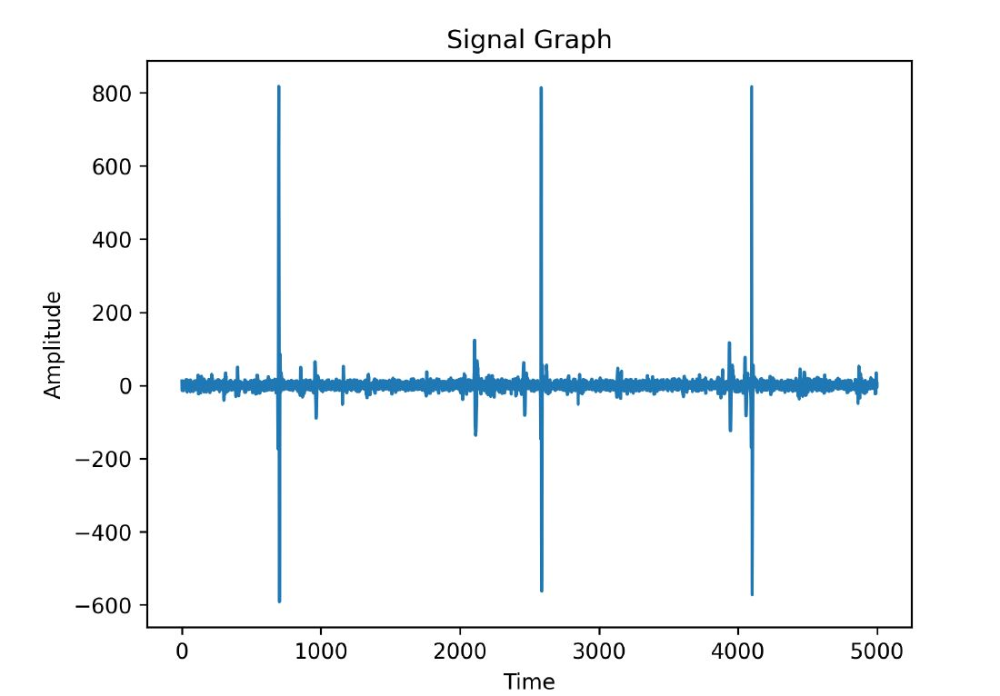
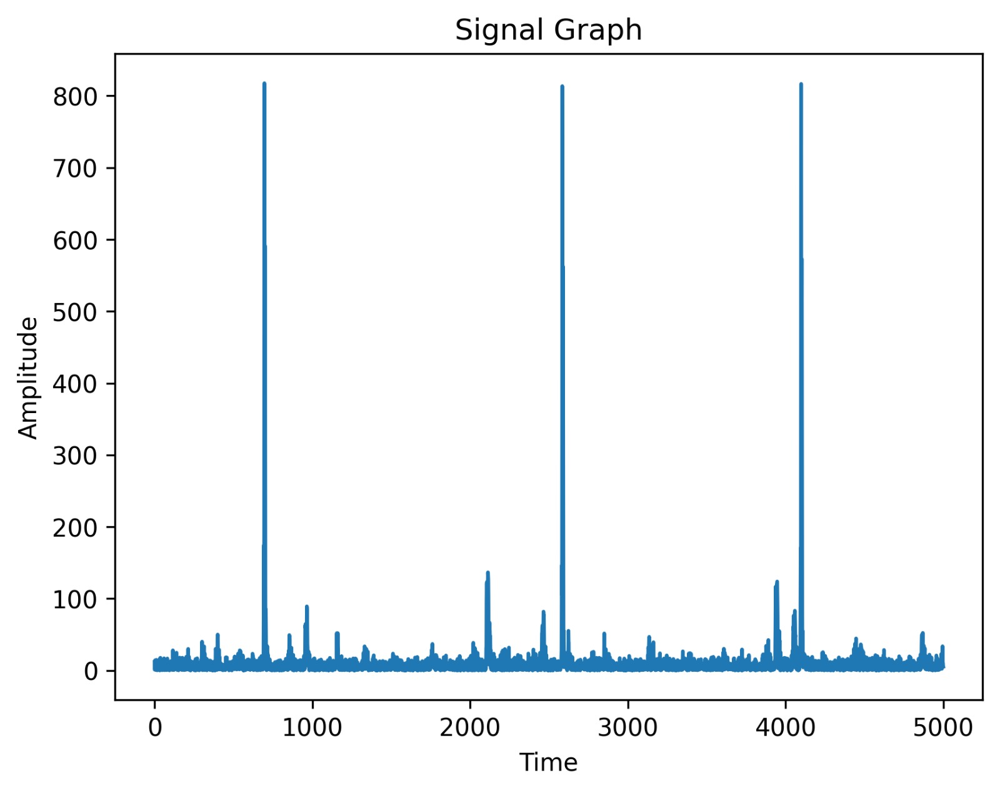
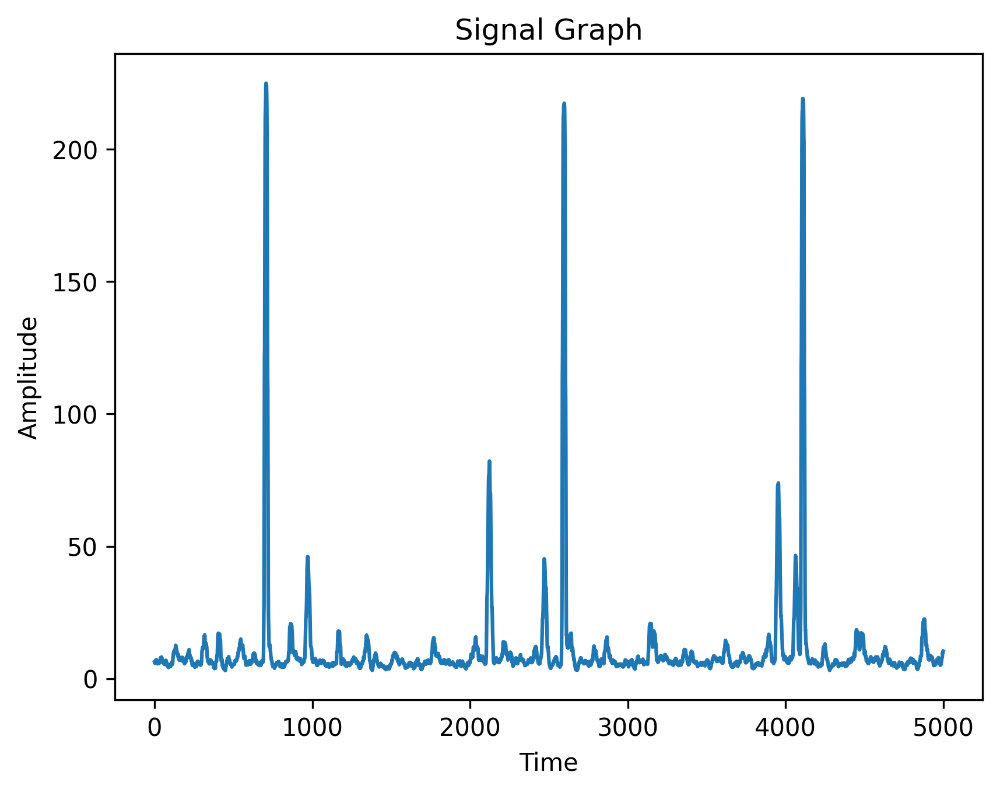
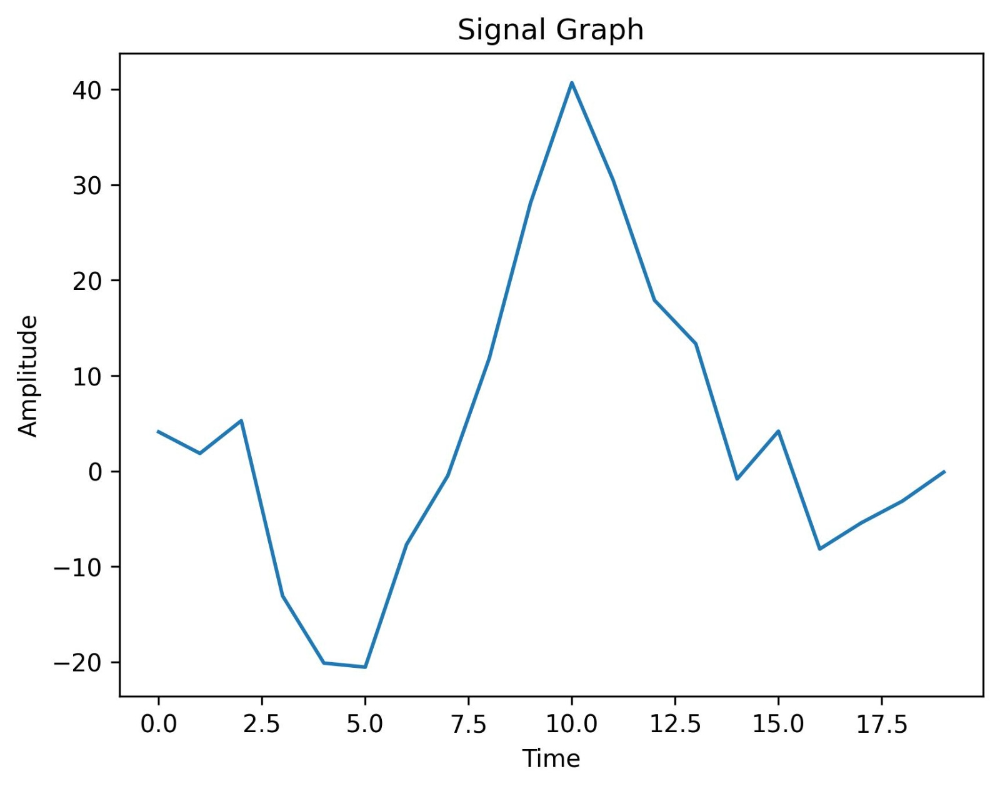
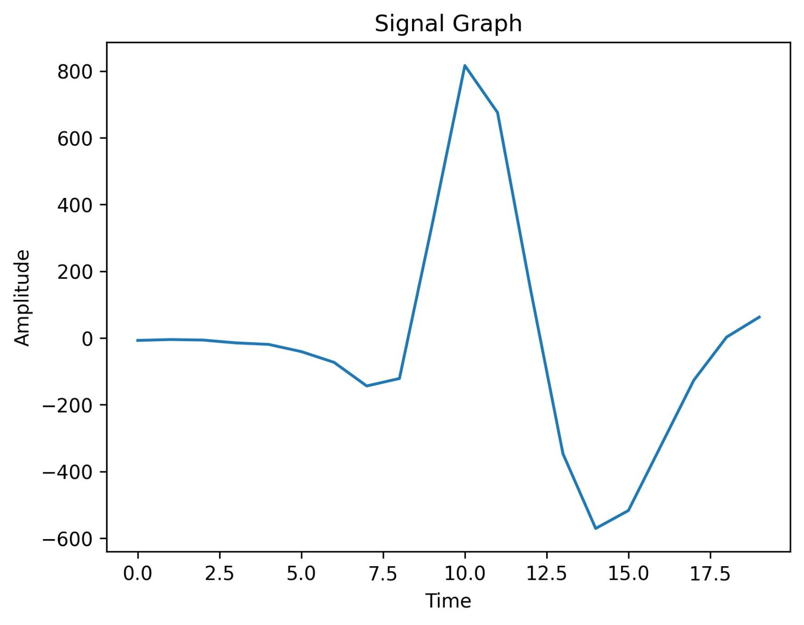
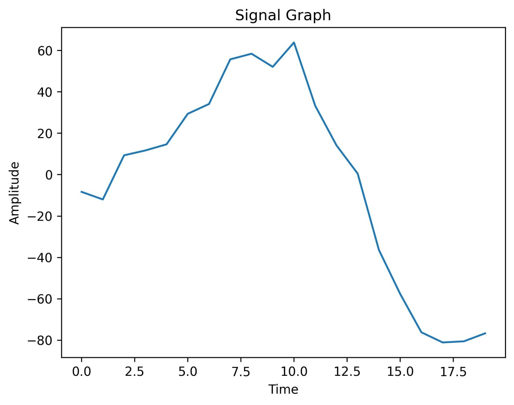
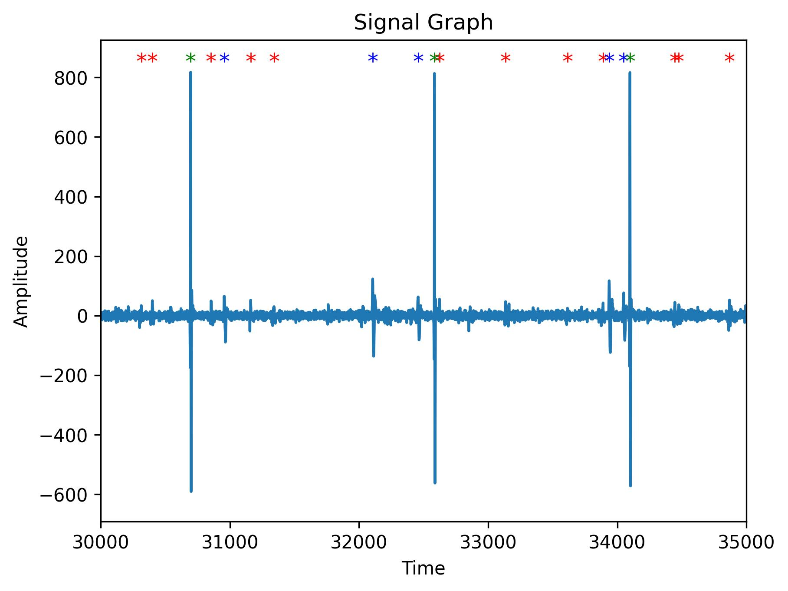
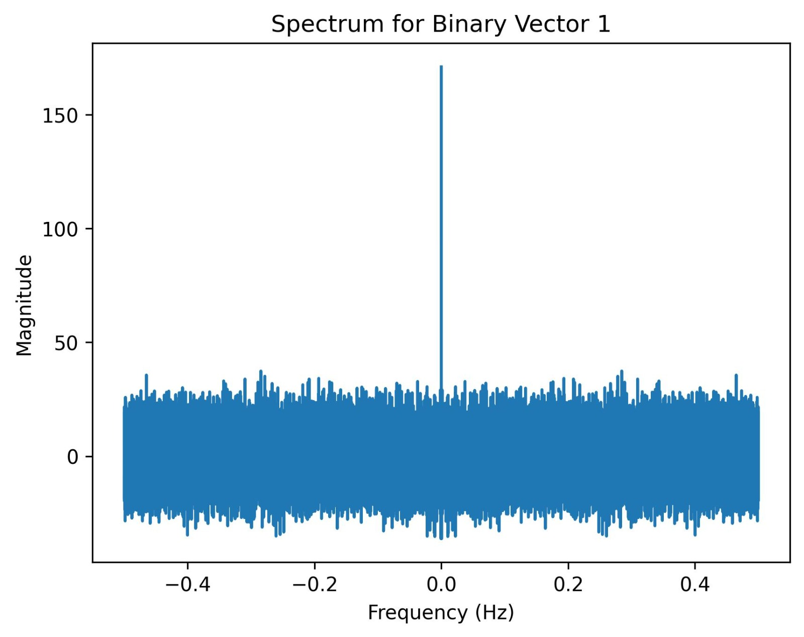
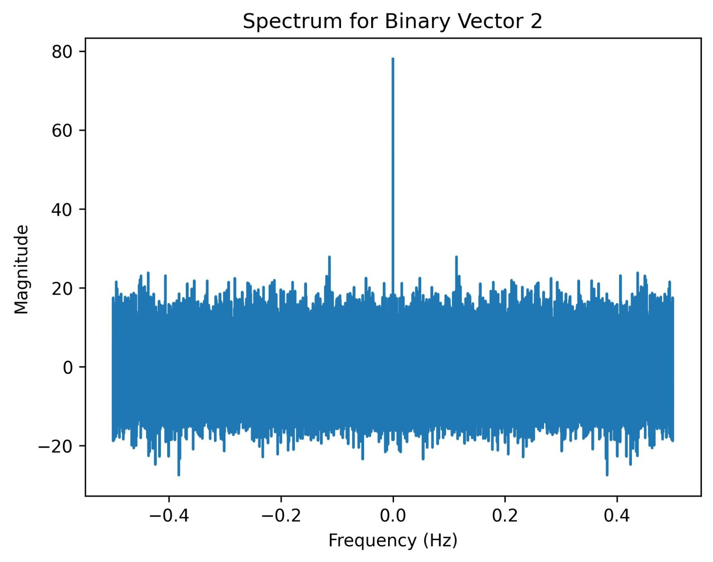
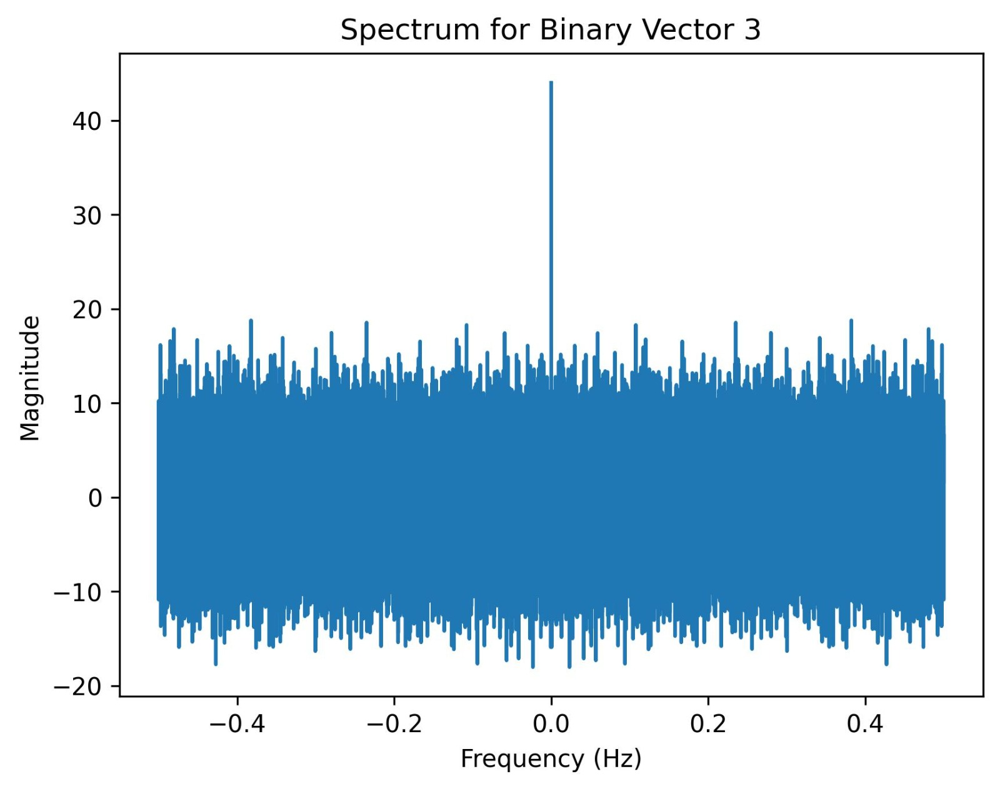

# Needle-EMG-Decomposition

## Project Overview

The Needle EMG Decomposition project involves implementing an algorithm to decompose EMG signals using needle electrodes. The algorithm detects Motor Unit Action Potentials (MUAPs) in the EMG signal and assigns timestamps to their peaks. It also creates templates for each Motor Unit (MU). The project analyzes an EMG signal with a window size of 21 samples and a predefined threshold (DiffTh) of 12.5. The outputs include 5 visual representations of the detected MUAPs and waveform templates. The project contributes to understanding MUAP detection and has potential applications in clinical diagnostics and muscle activity monitoring.

## Code Implementation

The code implements the needle EMG decomposition algorithm to detect and decompose Motor Unit Action Potentials (MUAPs) in an EMG signal. The methodology involves two steps:

### Step 1: Signal Rectification and MUAP Detection

- The EMG signal is first rectified by taking the absolute value of the signal.
- A moving average filter with a window size of T (defined as 21 in the code) is applied to smooth the rectified signal.
- MUAPs are detected based on a predefined threshold, which is set at 3 times the standard deviation of the noise (defined as Threshold = 11.7 in the code).
- The beginning of an MUAP is detected when the average of the rectified EMG in a window of length T samples exceeds the threshold.
- If more than T samples exceed the threshold, then they will all be included in the MUAP, and only the part surrounding the peak index by T/2 from right and left.
- The end of an MUAP is considered as the last sample recognized exceeding the threshold in the moving window T.

### Step 2: MUAP Comparison and Template Generation

- Detected MUAPs are compared with existing templates to determine if they belong to the same MU.
- Each MUAP is synchronized with the template's first MUAP by aligning their peaks at index T/2 (10 samples before and 10 samples after the peak).
- The difference between the MUAP and the template is computed using the following formula, where M represents the MUAP and T represents the template:

  Σ (𝑀(𝑖) − 𝑇(𝑖))²

- If the difference is less than a predefined threshold (DiffTh = 16.5 in the code), the MUAP is considered to belong to the template.
- If the MUAP does not match any existing templates, a new template is created using the MUAP as the initial estimate.
- The templates are updated by taking the average of the values of each corresponding template and MUAP.
- While checking the difference, if there’s more than one matching template, then go for the minimum difference.

## Results & Analysis

In this section, we present the results obtained from the implementation of the needle EMG decomposition algorithm. The code successfully detects and decomposes MUAPs in the EMG signal, providing insights into the waveform characteristics and templates. The following screenshots demonstrate the different stages of the decomposition process:

1. **Signal before rectification**: The screenshot displays the original EMG signal from sample 30000 to sample 35000 before rectification. It provides a visual representation of the raw signal, showing the fluctuations and variations in the recorded electrical activity. The waveform may exhibit different amplitudes and durations.
2. 

3. **Signal after rectification**: The rectified EMG signal is shown in this image. Rectification involves taking the absolute value of the EMG signal, resulting in a unipolar representation. This process eliminates negative components, allowing for easier detection and analysis of the MUAPs.
4. 

5. **Signal after applying the moving average filter**: The filtered EMG signal is presented in this image. The moving average filter is applied to smooth out the signal and reduce noise interference. The resulting waveform shows a smoother representation of the underlying MUAPs.
6. 

7. **Three MUAP templates**: The screenshot displays the templates extracted during the decomposition process. Each template represents a distinct MUAP waveform with unique characteristics. The templates may differ in peak amplitude, duration, shape, and other properties. These templates serve as references for identifying and categorizing MUAPs in the EMG signal.
8. 
9. 
10. 

11. **Signal with “*” and colored MUAPs**: The screenshot displays a segment of the EMG signal from sample 30000 to sample 35000. Detected MUAPs are marked with asterisks ("*") and colored based on the associated MU, red for template 1, blue for template 2, green for template 3.
12. 

13. **Spectrum of signal**: It is representing the MUAPs of each detected MU. It constructs a binary vector for each MU, with one indicating the time of MUAP generation, and zero otherwise. Then we find the spectrum of each of the three binary vectors using FFT.
14. 
15. 
16. 

## Acknowledgments

- This project is part of the CSCE 363/3611 – Digital Signal Processing course at The American University in Cairo, Summer 2023.

For more details, please refer to the project documentation and code provided in this repository. If you have any questions or need further assistance, feel free to contact the project contributors.
